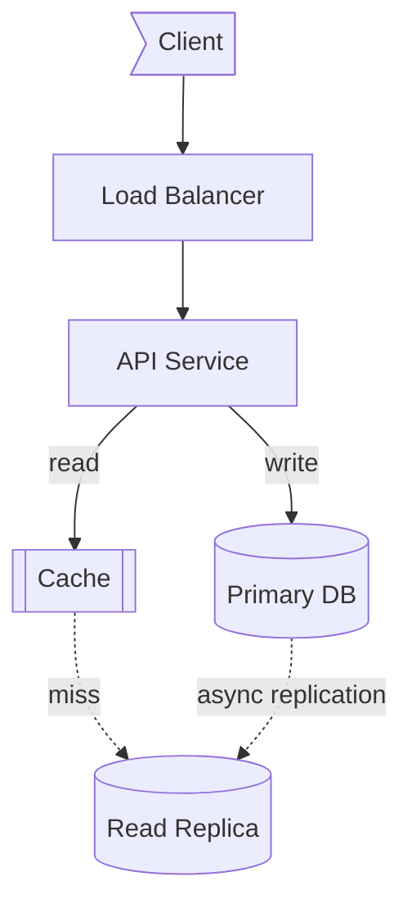
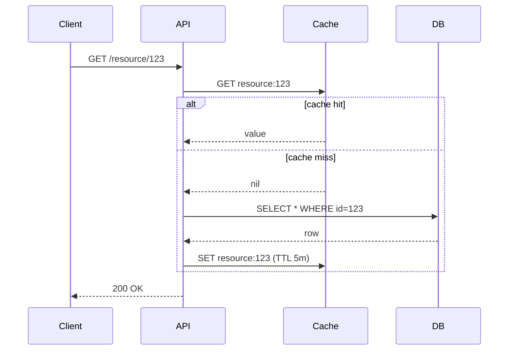
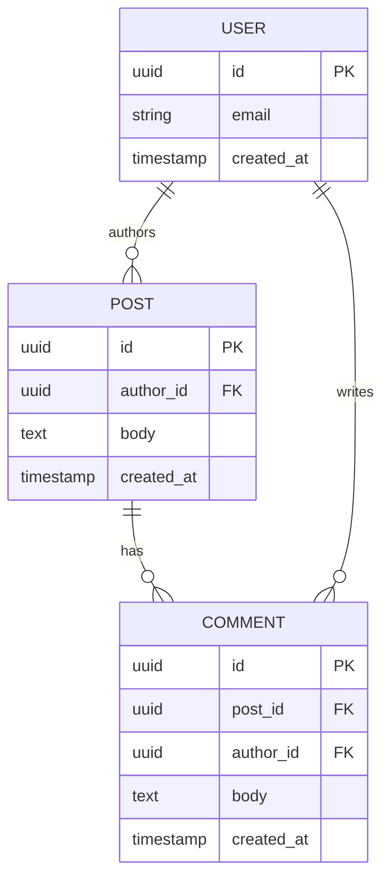
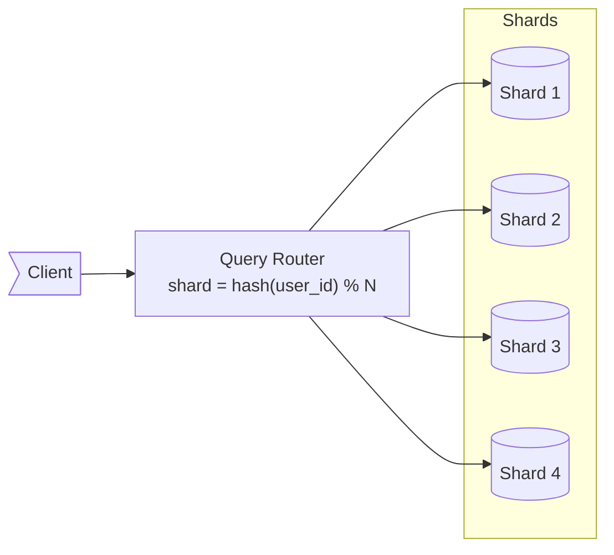

# diagrams — text-diagram cheatsheet for system design

Two supported styles. Pick via `--diagram-style`.

| Style | When to use | Default? |
|---|---|---|
| `ascii` | Renders in any terminal, including Codex CLI. Works in plain `git diff`, code-review tools, and Slack. | ✅ default |
| `mermaid` | Renders to images in Claude Code, GitHub, and most Markdown viewers. Use when the user is reading in a rendered surface, or asks for it. | opt-in |

**When to draw — this matters:**
- ✅ When playing the **candidate** in `learn` mode — for high-level architecture (after clarifications) and for any deep-dive that involves a request flow.
- ✅ In `postmortem` coaching when illustrating "what a stronger candidate would have done."
- ❌ Never as the interviewer in `mock` — interviewer asks, candidate draws.
- ❌ Never in `generate` — questions are prose only; diagrams give away the answer.

---

## §1 — Diagram types and when to use each

| Type | Use for | Example moment |
|---|---|---|
| Architecture flow | Component/service architecture, data flow between systems | "Here's the high-level architecture" |
| Sequence | Request flows, end-to-end walkthroughs | "Walk me through what happens on a read" |
| ER / schema | Data model, schema relationships | "Show me the schema" |

**Pick by question, not preference.** "Show me the architecture" → flow. "Walk me through end-to-end" → sequence. "What's the schema" → ER. Don't draw a flow when the interviewer wants a sequence.

---

## §2 — ASCII conventions (default style)

Keep it readable in any monospace font. Don't reach for Unicode box-drawing chars (`─│┌┐`) — they render unevenly across terminals and break in copy-paste.

**Components:**
- `[Service]` — stateless service / API
- `[(Database)]` — persistent store
- `[[Cache]]` — in-memory store
- `[/Queue/]` — message bus
- `((CDN))` — edge / CDN
- `>Client]` — external actor

**Arrows:**
- `-->` sync call
- `- ->` async / fire-and-forget
- `==>` high-volume / hot path
- Label on the arrow: `--read-->`, `--async-->`, `--~10KB-->`

**Flow direction:** Top-down for layered architectures (use `|` and `v`). Left-right for pipelines (use `-->` chains).

---

## §3 — Mermaid conventions (opt-in)

Use the same semantics as ASCII; just render in Mermaid syntax.

**Flowchart shapes:** `[Service]`, `[(Database)]`, `[[Cache]]`, `[/Queue/]`, `((CDN))`, `>Client]`.

**Direction:** `TD` (top-down) for layered, `LR` (left-right) for pipelines.

**Edges:** `-->` sync, `-.->` async, `==>` hot path. Labels: `-- gRPC -->`, `-- async -->`.

**Subgraphs:** group by tier, region, or trust boundary when it adds clarity.

---

## §4 — Canonical templates (both styles)

Four templates cover ~80% of what a candidate needs to draw. Adapt by renaming boxes and adding/removing components.

### Template A — Three-tier web service

The opening high-level architecture for almost any read-heavy service.

**ASCII:**

```
>Client]
   |
   v
[Load Balancer]
   |
   v
[API Service] --read--> [[Cache]]
   |                       |
   |                       | (miss)
   |                       v
   |--write--> [(Primary DB)] - -async repl- -> [(Replica)]
```

**Mermaid:**



Specialize the boxes (rename to actual services). Add a CDN in front for static-heavy workloads, or a queue + worker pair behind the API for async work — but only if the question asks for it.

### Template B — Cache-aside read (sequence)

The canonical request-flow walkthrough.

**ASCII:**

```
Client          API            Cache           DB
  |              |               |              |
  |--GET /res-->|               |              |
  |              |--GET key---->|              |
  |              |               |              |
  |              | [hit]         |              |
  |              |<--value-------|              |
  |              |               |              |
  |              | [miss]        |              |
  |              |<--nil---------|              |
  |              |--SELECT id=N----------------->|
  |              |<--row-------------------------|
  |              |--SET key TTL 5m-->|          |
  |              |                              |
  |<--200 OK----|                              |
```

**Mermaid:**



Use for any "walk me through a read" question. Make the cache-hit vs cache-miss paths explicit — a common interviewer probe.

### Template C — Simple data model (ER)

The familiar User / Post / Comment shape.

**ASCII:**

```
USER (id PK, email, created_at)
  | 1:N  authors
  v
POST (id PK, author_id FK -> USER.id, body, created_at)
  | 1:N  has
  v
COMMENT (id PK, post_id FK -> POST.id, author_id FK -> USER.id, body, created_at)

(also: USER 1:N COMMENT  via author_id  — writes)
```

**Mermaid:**



Use when the question turns to schema. Show primary keys and foreign keys explicitly. Cardinality matters: `1:N`.

### Template D — Sharding by hash

The classic horizontal-scaling diagram.

**ASCII:**

```
>Client]
   |
   v
[Query Router]   shard = hash(user_id) % N
   |
   +--> [(Shard 1)]
   +--> [(Shard 2)]
   +--> [(Shard 3)]
   +--> [(Shard 4)]
```

**Mermaid:**



Use when the question turns to scaling beyond a single primary. Label the shard key on the router — it's the most important detail. Mention the cross-shard query problem (scatter-gather) in narration, not in the diagram.

---

## §5 — Anti-patterns

- **Don't draw the kitchen sink.** Cap a diagram at ~10 components. If you need more, split into a high-level + drill-down.
- **Don't omit edge labels for non-obvious flows.** Two services connected by an unlabeled line tells the interviewer nothing.
- **Don't use a flow when a sequence is right.** "Walk me through what happens when X" wants temporal order; a static box-graph followed by prose narration is a missed beat.
- **Don't draw before clarifying.** A diagram before requirements is decorative — narrate what you're optimizing for first.
- **Don't repeat the diagram in prose.** "As you can see, the API calls the cache, then the database" is wasted breath. Narrate the *why*, not the *what*.
- **Don't mix styles in one session.** Pick `ascii` or `mermaid` at the start and stay there. Mixing forces the reader to context-switch.

---

## §6 — Quick syntax reference

### ASCII
- `[Service]` box, `[(DB)]` cylinder, `[[Cache]]` in-memory, `[/Queue/]` queue, `((CDN))` edge
- `-->` sync, `- ->` async, `==>` hot path
- Labels on arrows: `--read-->`, `--async-->`
- Sequence: `participant | participant | ...` columns; `--msg-->` arrows; `[guard]` for branches

### Mermaid
- Flowchart edges: `A --> B`, `A -.-> B` (dotted/async), `A ==> B` (thick/hot), `A -- label --> B`
- Sequence: `A->>B: msg`, `A-->>B: response`, `A-)B: async`, `alt cond ... else ... end`, `loop label ... end`
- ER cardinality: `||--||` 1:1, `||--o{` 1:N, `}o--o{` M:N
- Docs: [mermaid.js.org](https://mermaid.js.org/intro/)
