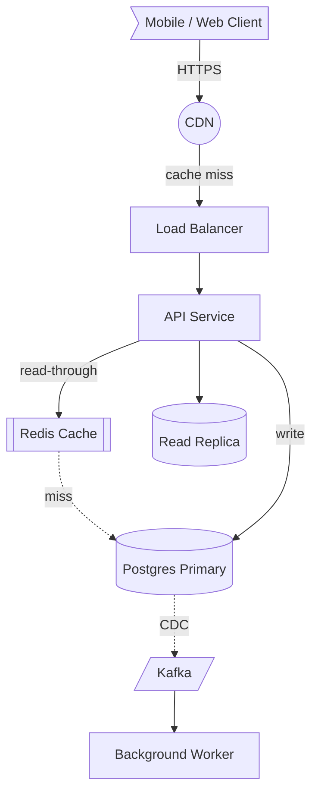
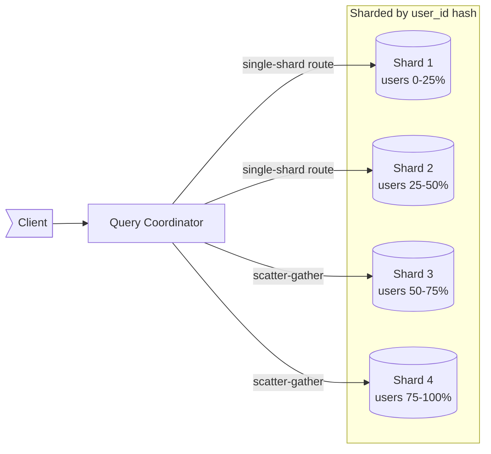
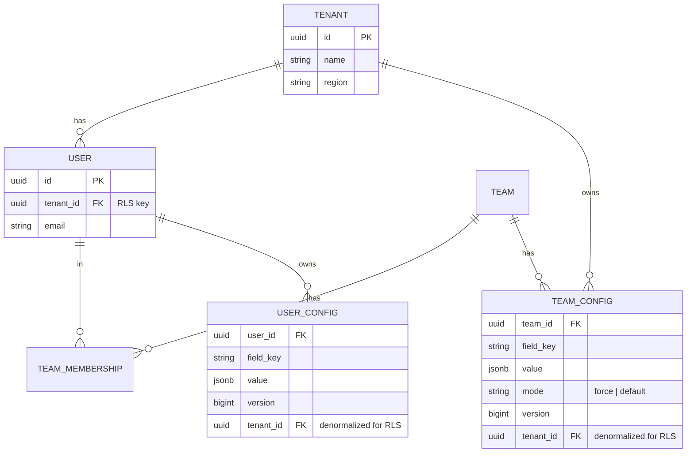
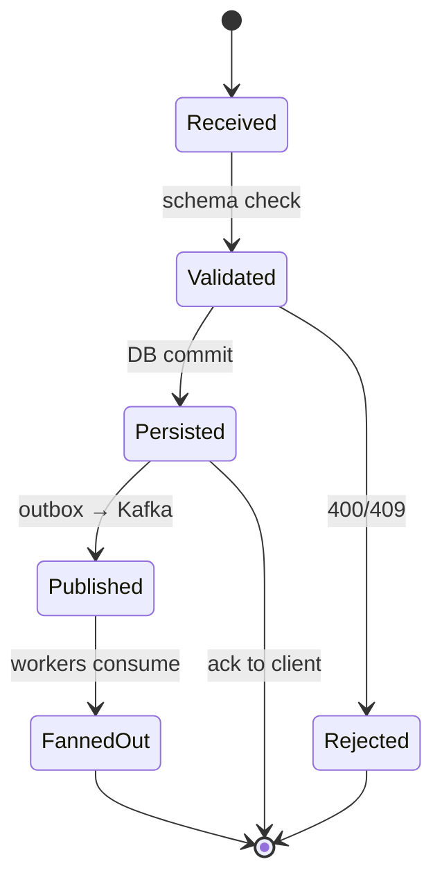
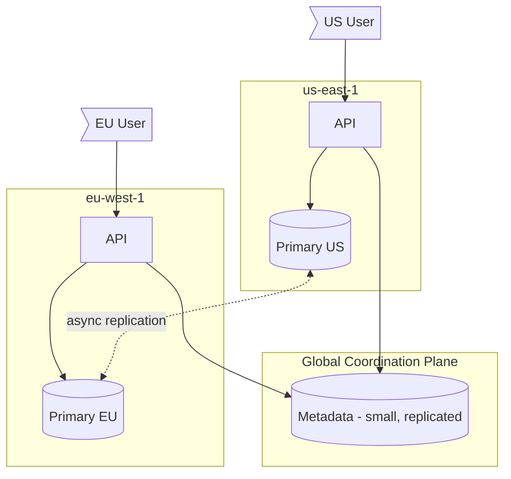
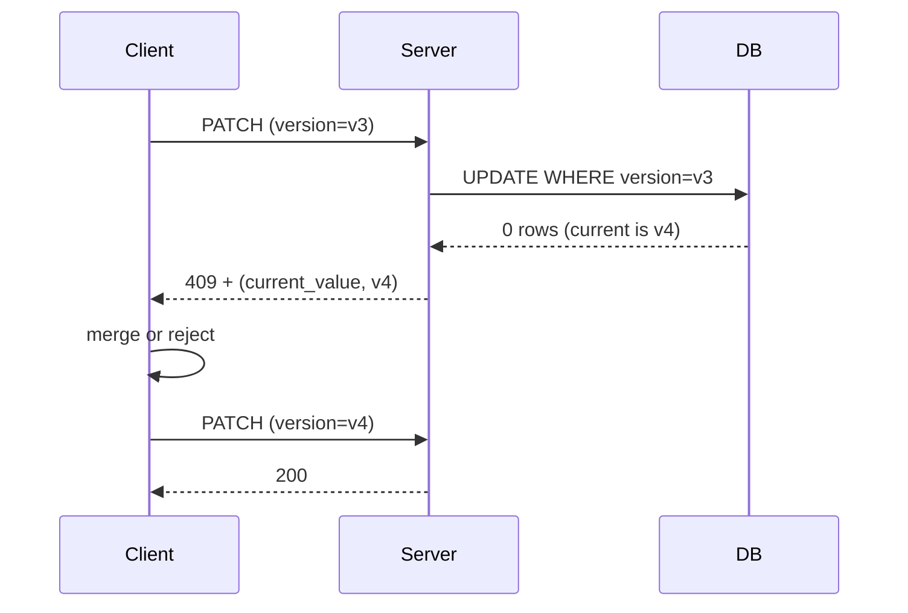
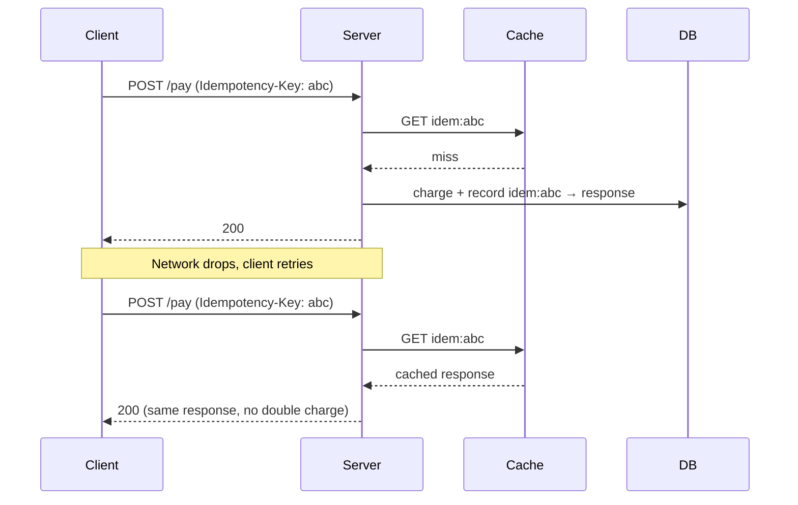
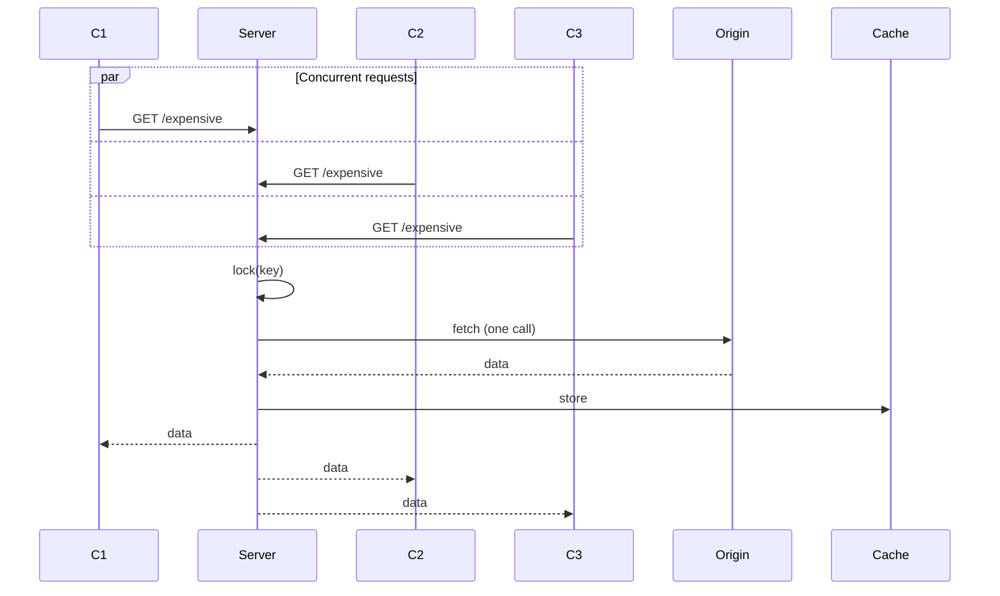

# diagrams — Mermaid cheatsheet for system design

Use Mermaid for all architecture diagrams. It's text-based (this skill can author it), renders natively in Claude Code, GitHub, and most modern markdown viewers, and has the right diagram types for system design.

**When to draw — this matters:**
- ✅ When playing the **candidate** in `learn` mode — both for the high-level architecture (after clarifications) and for any deep-dive that involves a request flow.
- ✅ In `postmortem` coaching when illustrating "what a stronger candidate would have done."
- ❌ Never as the interviewer in `mock` — interviewer asks, candidate draws.
- ❌ Never in `generate` — questions are prose only; diagrams give away the answer.

---

## §1 — Diagram types and when to use each

| Type | Use for | Example moment |
|---|---|---|
| `flowchart TD` / `flowchart LR` | Component/service architecture, data flow between systems | "Here's the high-level architecture" |
| `sequenceDiagram` | Request flows, t=0 wire-level stories, multi-party protocols | "Walk me through what happens when an admin clicks force-push" |
| `erDiagram` | Data model / schema relationships, foreign keys, cardinality | "Here's the data model" |
| `stateDiagram-v2` | Lifecycle of a single entity (order states, write request states, session states) | "What's the lifecycle of a payment?" |
| `C4Context` (and C4Container) | System-context view, useful at staff+ for "where does this sit" framing | Opening a multi-system design |

**Pick by question, not preference.** "Show me the architecture" → `flowchart`. "Walk me through end-to-end" → `sequenceDiagram`. "What's the schema" → `erDiagram`. Don't draw a flowchart when the interviewer wants a sequence.

---

## §2 — Conventions for system-design diagrams

Treat shape and direction as semantic, not decorative.

**Shapes (flowchart):**
- `[Service Name]` — stateless service / API
- `[(Database)]` — persistent store (Postgres, Cassandra, etc.)
- `[[Cache]]` — cache / in-memory store (Redis, Memcached)
- `[/Queue/]` — message bus / queue (Kafka, SQS, RabbitMQ)
- `((CDN))` — edge / CDN layer
- `>Client]` — external actor (browser, mobile app)
- `{Decision}` — routing / branching point

**Direction:**
- `TD` (top-down) for layered architectures (client → API → DB)
- `LR` (left-right) for pipelines and request flows
- Pick one and stick with it within a single diagram.

**Edge labels — always include them when non-obvious:**
- Label with protocol or semantic: `-- gRPC -->`, `-- async -->`, `-- WebSocket -->`
- Label with payload size when it matters: `-- ~10KB -->`
- Dotted edge `-.->` for async / fire-and-forget; solid `-->` for sync request/response.

**Subgraphs — use for tiers, regions, or trust boundaries:**
- Group by tier (edge / app / data) when explaining layered architecture.
- Group by region when designing multi-region.
- Group by tenant boundary when illustrating isolation.

---

## §3 — Templates (copy-paste and adapt)

### Template A — Generic 3-tier with cache, queue, edge



Use this as the **opening high-level architecture** for most read-heavy services. Specialize the boxes (rename to actual services) and remove what doesn't apply.

### Template B — Push fanout sequence (admin force-push to many devices)

```mermaid
sequenceDiagram
    autonumber
    participant Admin
    participant API as Config API
    participant DB as Postgres
    participant Outbox
    participant Kafka
    participant Fanout as Fanout Worker
    participant Redis as Redis Pub/Sub
    participant WS as WS Gateway
    participant Device

    Admin->>API: PUT /config (force-push)
    API->>DB: BEGIN; UPDATE config; INSERT outbox row; COMMIT
    DB-->>API: 200 OK
    API-->>Admin: 200 (committed)
    Outbox->>Kafka: PUBLISH team-config-changes (key=team_id)
    Kafka->>Fanout: consume
    Fanout->>Fanout: expand team_id → user_ids (Redis MGET)
    Fanout->>Redis: PUBLISH user:{id}:invalidate {version}
    Redis->>WS: deliver to subscribed gateways
    WS->>Device: WebSocket nudge {team_id, version}
    Device->>API: GET /config?since=v(n-1)
    API-->>Device: 200 (delta) or 304
    Note over Admin,Device: Wall-clock target: <30s p99
```

Use for any **t=0 wire-level walkthrough**. Numbered steps (`autonumber`) let the interviewer reference "step 5" without ambiguity. `Note over` calls out SLOs and invariants.

### Template C — Sharded data layer with coordinator



Use when explaining horizontal scaling. Label the shard key (`hash(user_id)`, `tenant_id`, etc.) — it's the most important detail.

### Template D — Data model with tenant isolation



Use when discussing **schema design**. Stamp `tenant_id` on every row — staff candidates name this as the multi-tenant isolation invariant.

### Template E — Write request lifecycle (state diagram)



Use when the question turns to **lifecycle, idempotency, or retry semantics**. The split path (ack to client at `Persisted` while async fanout continues) is the staff-level point.

### Template F — Multi-region active-active (subgraphs as regions)



Use for **multi-region** designs. Subgraphs make the region boundary visible. Dotted edges for async cross-region replication.

---

## §4 — Sequence diagram patterns worth memorizing

These are the high-value sub-patterns inside a `sequenceDiagram`:

**Optimistic concurrency / 409 retry:**


**Idempotency key dedup:**


**Single-flight / cache stampede prevention:**


---

## §5 — Anti-patterns (don't do these)

- **Don't draw the kitchen sink.** A diagram with 30 boxes is unreadable. Cap at ~10 components per diagram; split into a high-level + drill-downs if you need more.
- **Don't omit edge labels for non-obvious flows.** Two services connected by a line tells the interviewer nothing. `-- gRPC, p99 50ms -->` tells them everything.
- **Don't use `flowchart` when `sequenceDiagram` is right.** If the interviewer asked "walk me through what happens when X," they want a sequence diagram. Drawing a static box-graph and then narrating temporal order in prose is a missed beat.
- **Don't draw before clarifying.** A diagram before requirements is decorative. Diagram comes *after* you've stated what you're optimizing for.
- **Don't repeat the diagram in prose.** "As you can see in the diagram, the API calls the cache, then the database" is wasted breath. The diagram already said that — narrate the *why*, not the *what*.

---

## §6 — Quick reference: Mermaid syntax

**Flowchart edges:**
- `A --> B` solid arrow
- `A -.-> B` dotted (async / weak)
- `A ==> B` thick (high-volume / hot path)
- `A -- label --> B` labeled edge
- `A o--o B` association (no direction)

**Sequence diagram messages:**
- `A->>B: msg` solid arrow
- `A-->>B: response` dotted return
- `A-)B: async msg` open arrow (fire-and-forget)
- `Note over A,B: ...` annotation
- `loop label ... end`, `alt cond ... else ... end`, `par ... and ... end`

**ER cardinality:**
- `||--||` one to one
- `||--o{` one to many (mandatory on left, optional many on right)
- `}o--o{` many to many (optional both sides)

For more: [Mermaid official docs](https://mermaid.js.org/intro/).
