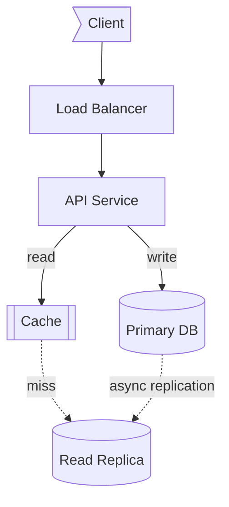
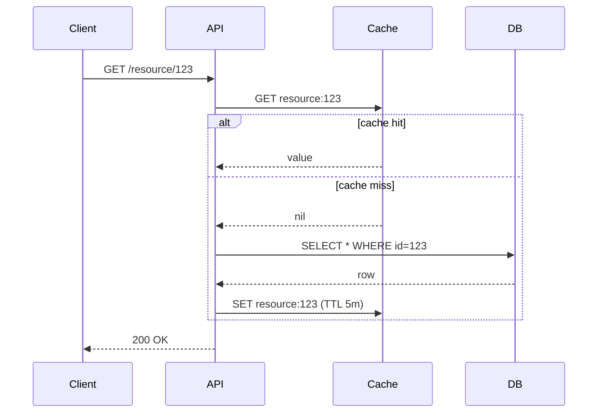
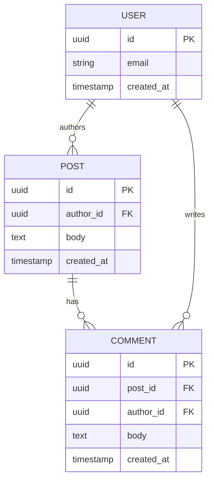

# diagrams — Mermaid cheatsheet for system design

Use Mermaid for all architecture diagrams. It's text-based (this skill can author it), renders natively in Claude Code, GitHub, and most modern markdown viewers.

**When to draw — this matters:**
- ✅ When playing the **candidate** in `learn` mode — for high-level architecture (after clarifications) and for any deep-dive that involves a request flow.
- ✅ In `postmortem` coaching when illustrating "what a stronger candidate would have done."
- ❌ Never as the interviewer in `mock` — interviewer asks, candidate draws.
- ❌ Never in `generate` — questions are prose only; diagrams give away the answer.

---

## §1 — Diagram types and when to use each

| Type | Use for | Example moment |
|---|---|---|
| `flowchart` | Component/service architecture, data flow between systems | "Here's the high-level architecture" |
| `sequenceDiagram` | Request flows, end-to-end walkthroughs | "Walk me through what happens on a read" |
| `erDiagram` | Data model, schema relationships | "Show me the schema" |

**Pick by question, not preference.** "Show me the architecture" → `flowchart`. "Walk me through end-to-end" → `sequenceDiagram`. "What's the schema" → `erDiagram`. Don't draw a flowchart when the interviewer wants a sequence.

---

## §2 — Conventions

Treat shape and direction as semantic, not decorative.

**Flowchart shapes:**
- `[Service]` — stateless service / API
- `[(Database)]` — persistent store
- `[[Cache]]` — in-memory store
- `[/Queue/]` — message bus
- `((CDN))` — edge / CDN
- `>Client]` — external actor

**Direction:** `TD` (top-down) for layered architectures, `LR` (left-right) for pipelines. Pick one per diagram.

**Edge labels:** include them when non-obvious. `-- gRPC -->`, `-- async -->`, `-- ~10KB -->`. Use `-.->` for async/fire-and-forget; `-->` for sync.

**Subgraphs:** group by tier, region, or trust boundary when it adds clarity. Skip if the diagram is small.

---

## §3 — Canonical templates

Four templates cover ~80% of what a system design candidate needs to draw. Adapt by renaming boxes and adding/removing components — don't invent new shapes or styles per question.

### Template A — Three-tier web service (flowchart)

The opening high-level architecture for almost any read-heavy service.



Specialize the boxes (rename to actual services). Add a CDN in front for static-heavy workloads, or a queue + worker pair behind the API for async work — but only if the question asks for it.

### Template B — Cache-aside read (sequenceDiagram)

The canonical request-flow walkthrough.



Use for any "walk me through a read" question. The `alt` block makes the cache-hit vs cache-miss paths explicit — a common interviewer probe.

### Template C — Simple data model (erDiagram)

The familiar User / Post / Comment shape.



Use when the question turns to schema. Show primary keys and foreign keys explicitly. Cardinality matters: `||--o{` is one-to-many.

### Template D — Sharding by hash (flowchart)

The classic horizontal-scaling diagram.

```mermaid
flowchart LR
    Client>Client]
    Router[Query Router<br/>shard = hash(user_id) % N]
    subgraph Shards
        S1[(Shard 1)]
        S2[(Shard 2)]
        S3[(Shard 3)]
        S4[(Shard 4)]
    end

    Client --> Router
    Router --> S1
    Router --> S2
    Router --> S3
    Router --> S4
```

Use when the question turns to scaling beyond a single primary. Label the shard key on the router — it's the most important detail. Mention the cross-shard query problem (scatter-gather) in narration, not in the diagram.

---

## §4 — Anti-patterns

- **Don't draw the kitchen sink.** Cap a diagram at ~10 components. If you need more, split into a high-level + drill-down.
- **Don't omit edge labels for non-obvious flows.** Two services connected by an unlabeled line tells the interviewer nothing.
- **Don't use `flowchart` when `sequenceDiagram` is right.** "Walk me through what happens when X" wants temporal order; a static box-graph followed by prose narration is a missed beat.
- **Don't draw before clarifying.** A diagram before requirements is decorative — narrate what you're optimizing for first.
- **Don't repeat the diagram in prose.** "As you can see, the API calls the cache, then the database" is wasted breath. Narrate the *why*, not the *what*.

---

## §5 — Mermaid syntax quick reference

**Flowchart edges:**
- `A --> B` solid arrow
- `A -.-> B` dotted (async / weak)
- `A ==> B` thick (high-volume / hot path)
- `A -- label --> B` labeled edge

**Sequence diagram messages:**
- `A->>B: msg` solid arrow
- `A-->>B: response` dotted return
- `A-)B: async msg` open arrow (fire-and-forget)
- `Note over A,B: ...` annotation
- `alt cond ... else ... end`, `loop label ... end`

**ER cardinality:**
- `||--||` one to one
- `||--o{` one to many
- `}o--o{` many to many

For more: [Mermaid official docs](https://mermaid.js.org/intro/).
